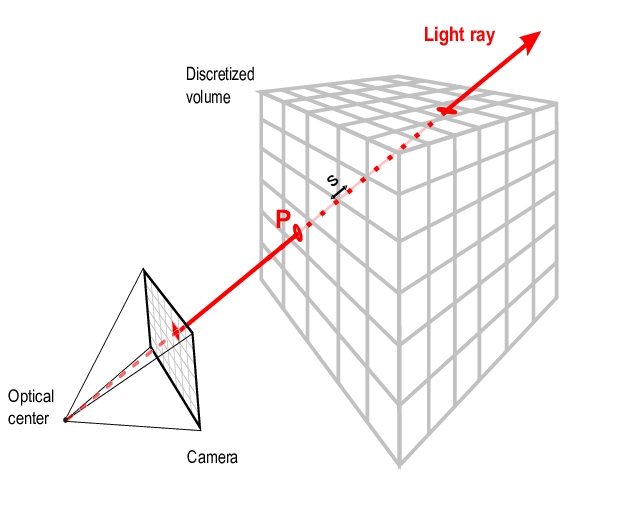

# Ray tracing algorithm

This project aims to realise a **ray tracing algorithm** for visualizing a 3D matrix, using the Godot game engine and a plugin called Compute Shader Studio. A matrix can be represented as a grid of coloured voxels; therefore, it covers various techniques of how to render and rotate the matrix in real time. This project hopes to investigate how the camera, rays, and the matrix interact, with a view to understand performance improvements and visual clarity afforded through the use of GPU compute shaders.


## Getting Started

These instructions will give you a copy of the project up and running on
your local machine for development and testing purposes.

### Prerequisites

Requirements for the software
- [Godot Game Engine 4.2](https://godotengine.org/download/archive/4.2.2-stable/)
- [Compute Shader Studio](https://godotengine.org/asset-library/asset/2415)

### Installing

```bash
git clone https://github.com/AnasFd/Ray-Tracing-Algorithm.git
```

- Run Godot 4.2

- From the Project Manager, select **Import**

- Navigate to the cloned repository folder and select **project.godot**

- Click **Import & Edit** to load the project.


## Running the program

1. In the Godot FileSystem, navigate to **compute-shader-3d**
2. Double-click **ray_tracing.tscn**
3. Click the **Run Project** button in the top right corner.

## Authors

  - **Pascal Ballet**
    [Pascal Ballet](https://github.com/pascal-ballet)
  - **Anas F**
    [AnasFd](https://github.com/AnasFd)

## Contributing

Feel free to submit pull requests or open issues for any improvements or bug fixes.

## License

This project is licensed under the [MIT](LICENSE.md) License.